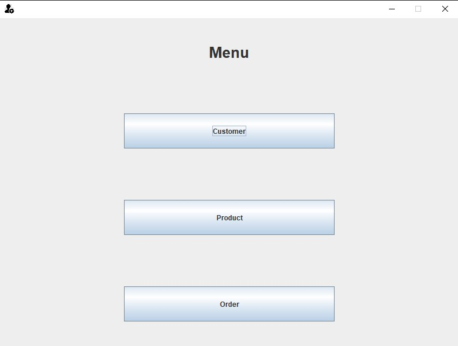
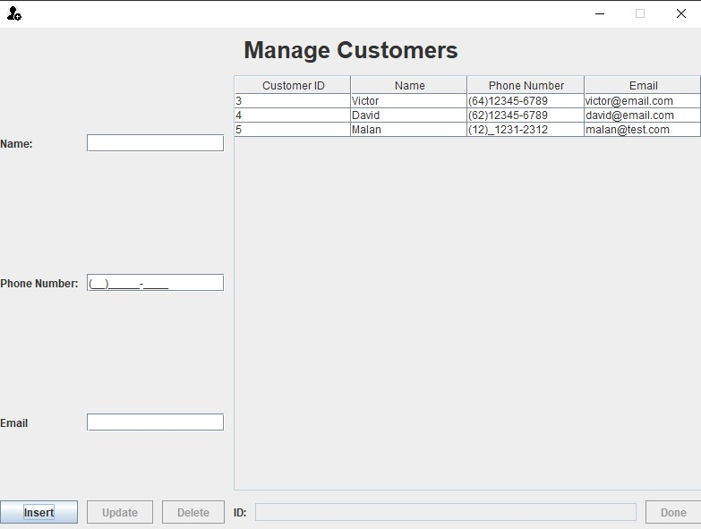
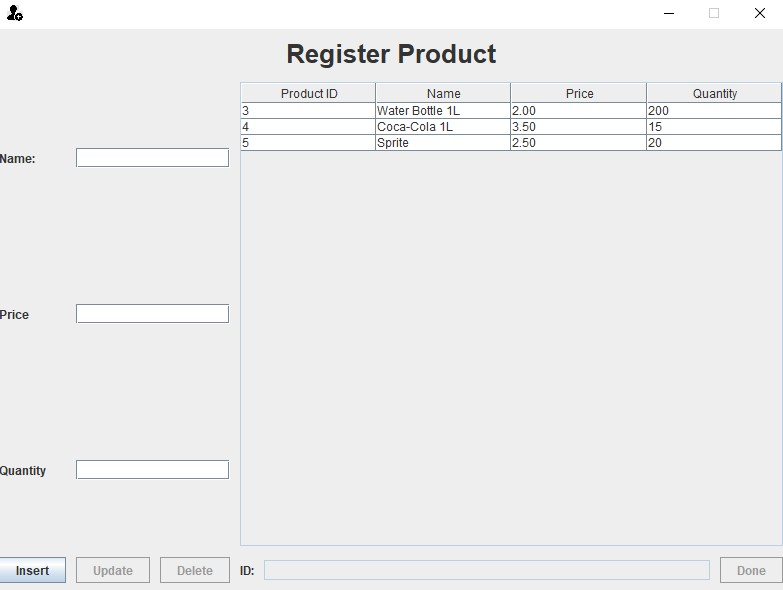
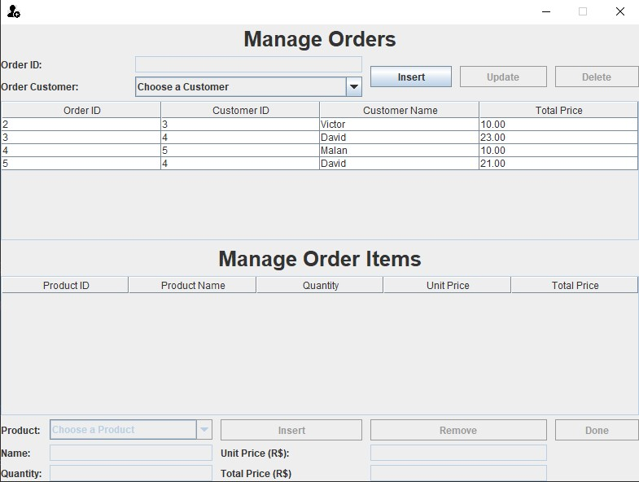

# Simple-GUI
#### Video Demo:  https://youtu.be/2ttKNype9nI
#### Description:

>This was my final project for the CS50 Introduction to Computer Sciense course.
## About the System

This project allows the user to manage Customers, Products and Orders.

I decided to use MVC/Clean Architecture in order to better distribute responsibility, improve reusability and have a well organized repository. In addition to that I also implemente the DAO (Data Access Object) design pattern so I could abstract the database operations.

## GUI

| Menu | Customers |
| :---: | :---: |
|   | |

| Products | Orders |
| :---: | :---: |
|   | |

## About the Development
I've used [Java Swing](https://docs.oracle.com/javase/7/docs/api/javax/swing/package-summary.html) to create a simple project containing 4 distinct GUIs.

In this project I decided to design my database using [MySQL](https://www.mysql.com/) because I recently started using it in a university project and wanted to dig deeper into it.

I used 2 libraries called rs2xml and mysql-connector to deal with ResultSets and the MySQL database. And got some help from a thread in StackOverflow that was discussing how to build a table model based on a ResultSet.

So in my pursuit of learning more about MySQL I decide to create a few triggers (8 in total) to help control the stock of products, and in adition to that, automatically calculate the price of OrderItems and Orders.

Also found it interesting that I could receive information from my database throught the use o SIGNAL SQLSTATE.
```SQL
IF NEW.quantity > stock_quantity THEN
    SIGNAL SQLSTATE '45001' SET MESSAGE_TEXT = 'Quantity higher than available stock';
END IF;
```

### Objects

```java
public class Customer {
    int id;
    String name;
    String phoneNumber;
    String email;
    boolean deleted;
}

public class Product {
    int id;
    String name;
    float price;
    int quantity;
    boolean deleted;
}

public class Order {
    int id;
    int customerId;
    float totalPrice;
    boolean deleted;
}

public class OrderItem {
    int orderId;
    int productId;
    int quantity;
    float unitPrice;
    float totalPrice;
}
```


## How to setup the project

In order to run this project you must first install MySQL 8.0.31 and run this [script](database/script.txt) to create the database schema.

Also make sure to add both [rs2xml](./lib/rs2xml.jar) and [mysql-connector](./lib/mysql-connector-j-8.2.0.jar) to the project structure as dependencies.

## Possible improvements
It's possible to improve the Validation and Parsing method being used.<br/>

Currently the validation is done inside the `Controller`, throught the use of a method for each variable entered by the user. Based on the `String` retuned, if it is not empty, a message is show to the user telling them what was done wrong. <br/>

This works, but diminishes the readability.<br/>

Instead I could implement Custom Exceptions and treat those inside the `Controller`, removing the return of `String` that is a possible point of failure. Also validating it all inside a single method would make enhance readability.

